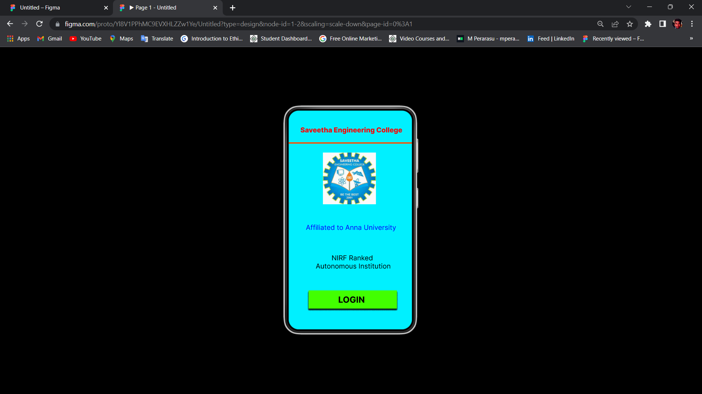
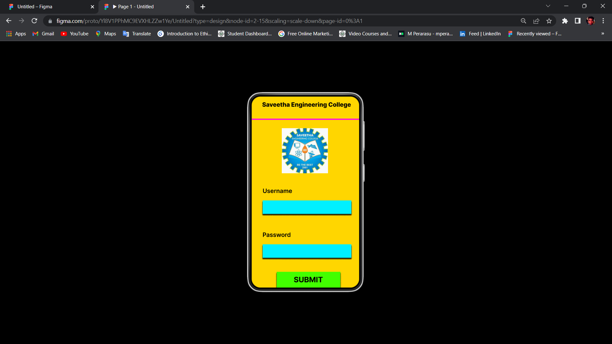
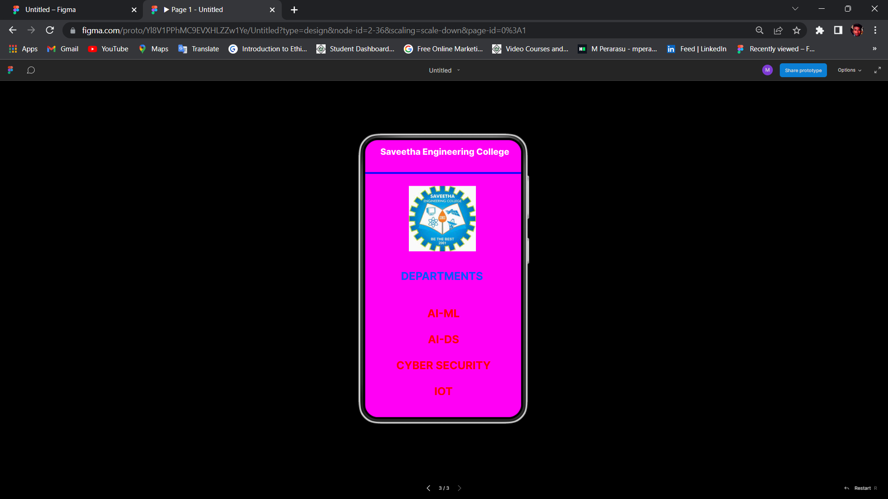

# Event Registration Web Application

## AIM:
To design, develop and deploy a web application for event registration.

## DESIGN STEPS:

### Step 1:
Create a new frame.

### Step 2:
Select any one preset size of your choice.

### Step 3:
Select the shapes you need.

### Step 4:
Import images as needed.

### Step 5:
Create pages based on your need and link them.

### Step 6:

Validate the HTML and CSS code.

### Step 6:

Publish the website in the given URL.

## DESIGN TOOL:
Figma

## CODE :
```
/* HOME PAGE */
position: relative;
width: 425px;
height: 736px;
background: #00F0FF;
/* LOGIN */
position: relative;
width: 426px;
height: 736px;
background: #FFD600;
/* Saveetha Engineering College */
position: absolute;
width: 352px;
height: 33px;
left: 36px;
top: 35px;
font-family: 'Inter';
font-style: normal;
font-weight: 800;
font-size: 20px;
line-height: 24px;
text-align: center;
color: #FFFFFF;
/* Line 2 */
position: absolute;
width: 425px;
height: 0px;
left: 1px;
top: 98px;
border: 4px solid #000AFF;
/* logo 2 */
position: absolute;
width: 155px;
height: 151px;
left: 129px;
top: 126px;
background: url(logo.jpg);
/* DEPARTMENTS */
position: absolute;
width: 267px;
height: 43px;
left: 72px;
top: 319px;
font-family: 'Inter';
font-style: normal;
font-weight: 700;
font-size: 25px;
line-height: 30px;
text-align: center;
color: #0057FF;
/* AI-ML AI-DS CYBER SECURITY IOT */
position: absolute;
width: 230px;
height: 204px;
left: 94px;
top: 405px;
font-family: 'Inter';
font-style: normal;
font-weight: 700;
font-size: 25px;
line-height: 30px;
text-align: center;
color: #FF0000;
```
## OUTPUT:




## RESULT:
The program to design, develop and deploy a web application for event registration is completed successfully.
